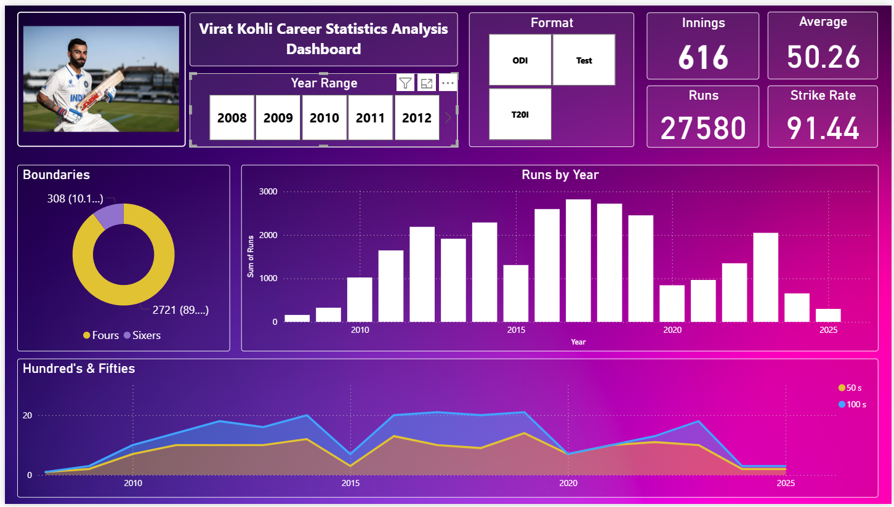

# Virat Kohli Career Statistics Dashboard 📊🏏

  
*Interactive Power BI dashboard visualizing Virat Kohli's cricket stats—dive into the data of one of cricket's greatest!*

## Project Overview
This project is an interactive dashboard built with **Power BI** to analyze Virat Kohli's illustrious cricket career from 2008 to 2025. Using raw data from his performances in Test, ODI, and T20I formats, the dashboard uncovers trends, peaks, and milestones. Whether you're a cricket fan, data enthusiast, or aspiring analyst, this tool brings stats to life with dynamic visualizations.

Key stats at a glance (across all formats):  
- **Total Runs**: 27,580  
- **Innings Played**: 616  
- **Overall Average**: 50.26  
- **Strike Rate**: 91.44  
- **Centuries/Half-Centuries**: 82/143  
- **Boundaries**: 2,721 fours and 308 sixes  

Data spans his debut to recent 2025 performances, highlighting eras like his dominant 2016-2019 phase.

## Features ✨
- **Interactive Filters**: Select year ranges or formats (Test/ODI/T20I) to customize views.  
- **Visualizations**:  
  - Bar chart: Runs scored by year.  
  - Line graph: Hundreds and fifties over time.  
  - Pie chart: Boundary breakdown (fours vs. sixes).  
  - KPI Cards: Quick stats like total runs, average, strike rate, and innings.  
- **Insights**: Spot trends such as peak averages (e.g., 133.6 in ODIs 2018) or dips (e.g., post-2020).  
- **Data-Driven**: Built on cleaned Excel data with DAX calculations for metrics like averages and strike rates.  

## Technologies Used 🛠️
- **Power BI**: For dashboard creation and interactivity.  
- **Excel**: Source data storage and initial processing.  
- **DAX**: Custom measures for calculations (e.g., Average = DIVIDE(SUM(Runs), SUM(Outs))).  

## Installation & Setup 🚀
1. **Clone the Repo**:(https://github.com/Priyanshu-Maliyan/Virat_Kohli_Career_Statistics_Dashboard.git) .

2. **Requirements**:  
- Power BI Desktop (free download from [Microsoft](https://github.com/Priyanshu-Maliyan/Virat_Kohli_Career_Statistics_Dashboard.git)).  
- The provided `Virat Kohli statistics.xlsx` file (included in repo).  

3. **Open the Dashboard**:  
- Launch Power BI Desktop.  
- Open the `.pbix` file (upload your dashboard file to the repo and name it e.g., `kohli-dashboard.pbix`).  
- Connect to the Excel data source if prompted.  
- Interact away—filter, hover, and explore!  

## Data Source 📂
- **File**: `Virat Kohli statistics.xlsx` (two sheets: "Raw" for format-specific data, "Overall" for combined).  
- **Origin**: Aggregated from public cricket databases like ESPNcricinfo or Cricbuzz (as of August 2025).  
- **Key Columns**: Year, Format, Innings, Runs, Balls, Outs, Avg, SR, HS, 50s, 100s, 4s, 6s, Dot %.  

Sample Data Snippet (Test Totals):  
| Format | Innings | Runs | Avg | SR | 100s | 50s |  
|--------|---------|------|-----|----|------|-----|  
| Test   | 210     | 9,211| 46.8|55.5| 30   | 31  |  

For full data, check the Excel file.

## Usage Examples 🔍
- **Explore Peaks**: Filter 2016-2019 to see Kohli's golden run (e.g., 1,215 Test runs in 2016 at 75.9 avg).  
- **Compare Formats**: Switch between ODI (58.1 avg) and T20I (48.7 avg) for strike rate insights.  

## Contributing 🤝
Love cricket or data viz? Fork this repo, add features like opponent analysis or bowling stats, and submit a PR! Issues and suggestions welcome.

*Star the repo if you found this useful! ⭐*
